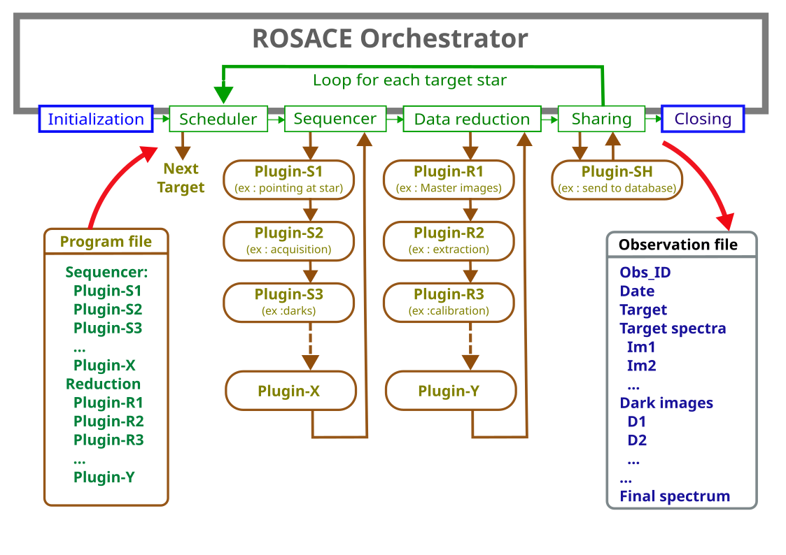

.. _AtAGlance-label:

ROSACE at a glance
==================

Welcome to the :ref:`ROSACE project <MainPage>`.

The core of the system is an Orchestrator. It manages the observations from initialization of the observatory
to its closure, and runs the observing and data reduction sequences for each target stars.
The observing sequence is made of plugins, that you can adapt to your own needs. And the same for the data
reduction sequence. 
  
Before starting the observing process, you must make sure that the observing conditions (weather) are good
enough - this is out of the scope of ROSACE.

The Orchestrator runs different steps, one after the other. This is described in this figure:

It has a simple behavior: it starts the session by an INIT step (for instance to connect the hardware and cooling down the cameras).
Then, it loops for each target the scheduler (to define what is the next target), the sequencer (for data acquisition), the data reduction
and the sharing (to send the data to the right place, like a database). At the end of the session, it closes it (disconnect the hardware, and so on).

Each step for the sequencer and data reduction is made of plugins that you can adapt to your own needs.

The list of plugins that must be used for a given observation are descrived in a Program file (.yaml format). This means the each observation 
can have it own sequence (for data acquisiton, for data reduction, and for sharing).The plugins are dynamically loaded. 

The Orchestrator creates an Observation file at the beginning of the observation. This file will go through all the steps (plugins), 
and each plugin will enrich it. At the end of the observation, this Observation file is the memory of the observation. 
All necessary data are recorded there: date, target, scientific program, raw images, data processing steps, and at the end the processed spectrum.

This Observation file is the only information that is known by each plugin. This makes all plugins independant from each other - and this is why it is easy to make or adapt your own plugins.

You'll find more details of each step in the following pages:

* Step 1: :ref:`initialization (once at the beginning of the session) <Module1-label>`
* Step 2: :ref:`Shelduler (what is the next target to observe) <Module2-label>`
* Step 3: :ref:`Sequencer (run the actual observation) <Module3-label>`
* Step 4: :ref:`Data reduction (to get a scientific result) <Module4-label>`
* Step 5: :ref:`Display, validate and share the results <Module5-label>`
* Step 6: :ref:`Archiving the results <Module6-label>`
* Step 7: :ref:`Closing the session (once at the end of the session) <Module7-label>`
